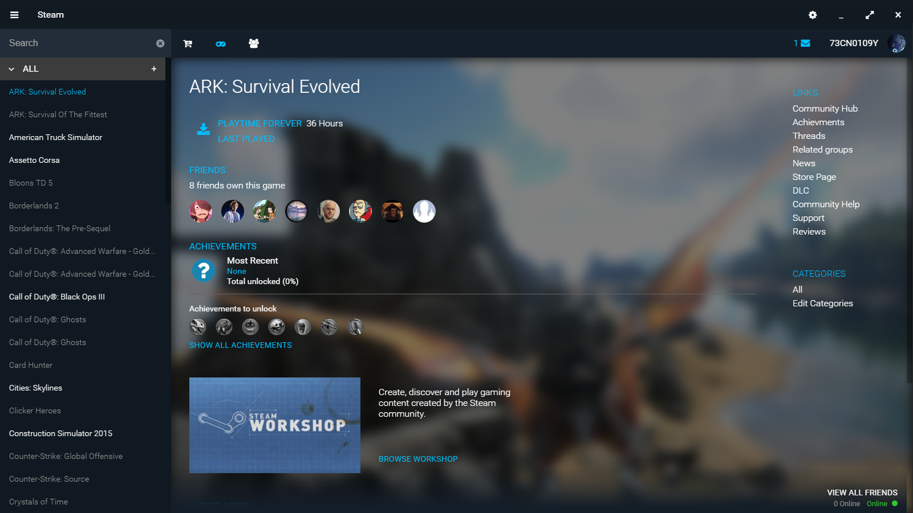

# Steam - OrigamiOS Tribute
###### Original concept by [mrtomone](http://mrtomone.deviantart.com/) can be found [here](http://www.deviantart.com/art/Origami-OS-2-4-2-Concept-Update-556728058) (Redirects to appropriate DeviantArt pages)

1. [What is this?](#what-is-this)
2. [Installing](#installing)
3. [Getting Started](#getting-started)
4. [Screenshots](#screenshots)
5. [Notice](#notice)

## What is this?
This is a proof-of-concept for a steam client based upon the design from mrtomone (linked above). Only the library view was shown in the concepts so the others pages were (noticeable) designed by me :D

There are some things this can't do because of API limitations. For example, you can't see your current wallet balance outside of the store. Unfortunately this still requires Steam to be installed and running (If it isn't this will launch it when starting a game) because Steam games can't be launch without the Steam client.

## Installing
**TODO: Make instructions :)**

## Getting Started
- The first time you launch the client, you will need to connect your steam account. Simply follow the instructions provided in the client to do so.
- After you have done that it may take a while for all your data to become available. Whilst you are waiting for that, head into the settings, click the `Downloads` tab, and add all the directories where your steam games are installed.
- **NOTE: You have to add at least one directory that has the `steam.exe` executable in it. (For example, if your `steam.exe` is located at `C:\Program Files\Steam\steam.exe` you should add the `C:\Program Files\Steam` directory)**
- **NOTE: Do not add the `steamapps/common` directory. Instead, simply add the `Steam` directory which contains the sub-directories `steamapps/common`**

## Screenshots

## Notice
Any and all data is provided as is and without guarantee. We may collect and store personal information about you and/or your associates to make your experience better. This includes, but is not limited to, storing it in a database or by using caching technology.

[Privacy Policy](./public/privacy_policy.html)
